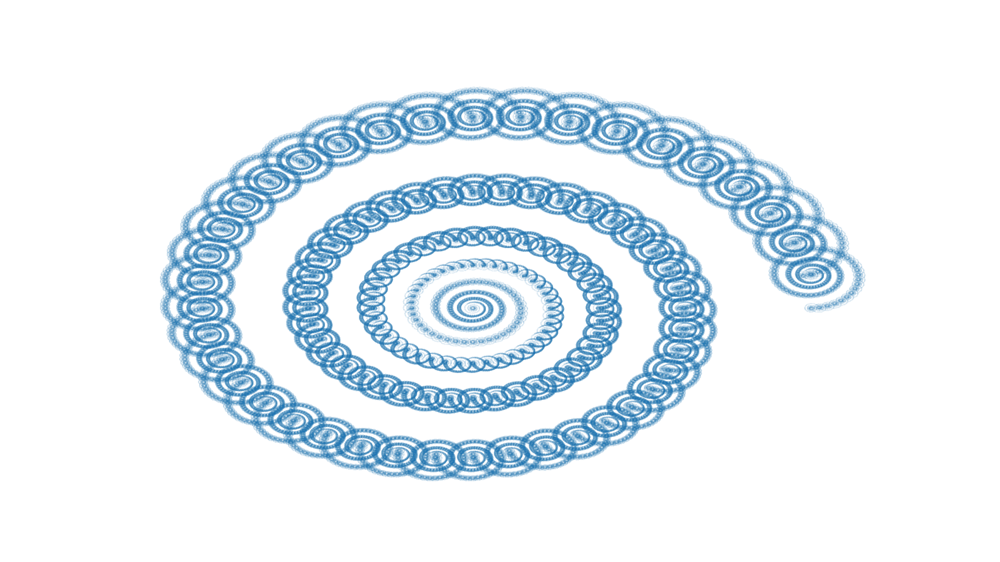

# Fractal animation

## Basic premise
This is a basic tool for making animations consisting of fractal changing over time, or making picture of fractal. Program assumes that fractal making process consists of replacing each of the line segments from previous step, with piecewise linear curve (line consisting of line segments). One of the consequences of this is each line segment from __transformation\_step__ needs to be shorter than 1. When line segments, of __transformation\_step__, are of vastly different lengths, normally leads to a situation when different areas of the curve need different amounts of iterations to produce result to set level of detail. Thats why this program stops iterations on line segment when it's below specified size __tol__. Note that amount of memory and computing power needed rises exponentially with decreasing __tol__ and this problem is more severe while creating animations, because of concurrent frame creation. 

## Explanation of variables

__max\_iter__- Maximal number of iterations of transformation_step before ending calculations. Calculations may end before __max\_iter__, should condition specified by tol be satisfied.

__tol__- Should a line width be below this value, iterations on it will be stopped.

__number\_of\_worker\_threads__- Number of workers used in multiprocessing.Pool. This enables script to calculate multiple frames concurrently. Note that this sharply increases amount of memory utilized by script.

__number\_of\_frames__- Number of frames in video produced by script.

__fps__- Target frames per second in produced video.

__point\_on\_line__- When this function is given index of current frame (__frame_index__), number of frames in animation (__number_of_frames__) and (__end\_of\_line\_space__) it will return value from interval <-1+__end\_of\_line\_space__, 1-__end\_of\_line\_space__> increasing with increase of ratio of __frame_index__/(__number_of_frames__-1). When __point_on_line__ is set to __normal_point_on_line__ spacing between points will be uniform and __adjusted_point_on_line__ will produce distribution more clustered near point 0.

__end\_of\_line\_space__- Functions used to generate __transformation\_step__ map arguments __number\_of\_frames__ and index of current frame to an interval <-1+__end\_of\_line\_space__, 1-__end\_of\_line\_space__>. Its role is culling slowly converging edge cases of animation frames. See __point\_on\_line__.

__animation\_name__- Name of video produced by script. ".mp4" is added to end of the string.

__starting\_line__- Starting configuration, before iterations. Only change this by replacing it by other line and never change number of points in  this.

__transformation\_step__- It defines how starting_line is changed during first iteration. In subsequent iterations result is split into lines and then transformation step is applied to each of them. Note that changes of orientation required by dragon curve and Sierpinski's triangle are defined elsewhere.

__alternating__- While its value is 1 nothing happens. Changing its value to -1 means alternating orientation of transformation (like in dragon curve).

__change\_alternation__- It modifies behavior of __alternating__. While its value is 1 nothing happens. Changing its value to -1 results in changes of starting orientation in each iteration. Lets use animation with Sierpinski's triangle as an example and lets denote "normal" orientation as 1, and "negative" orientation as -1. This means that in each step we replace any line in previous step with 3 lines of equal length (see [next section](#variable-values-used-for-animations)). Orientations in each step will be: 1 in first step, -1, 1, -1 in second, 1, -1, 1, -1, 1, -1, 1, -1, 1 in third, etc.

## Variable values used for animations
Lets consider a circle whose diameter is __starting\_line__. If we consider a non degenerate polygon then __starting\_line__ is its longest edge. This means that transformation of replacing __starting\_line__ by piecewise linear curve consisting of rest of the edges of the polygon will produce a fractal of finite size. All examples below use this line of reasoning.

### Animation containing dragon curve
See [Wikipedia page of dragon curve](https://en.wikipedia.org/wiki/Dragon_curve)
Transformation step is defined by right triangle with its right angle moving along upper arc.
Dragon curve emerges when triangles sides are equal.

__max\_iter__=500

__tol__=2*10**(-3)

__number\_of\_worker\_threads__=4

__number\_of\_frames__=501

__point\_on\_line__=adjusted_point_on_line

__end\_of\_line\_space__ =1/10

__transformation\_step__=transformation_step_dragon_curve

__alternating__=-1

### Animation containing Levy C curve
See [Wikipedia page of Levy C curve](https://en.wikipedia.org/wiki/L%C3%A9vy_C_curve)
Transformation step is defined by right triangle with its right angle moving along upper arc.
Levy C curve emerges when triangles sides are equal.

__max\_iter__=500

__tol__=2*10**(-3)

__number\_of\_worker\_threads__=4

__number\_of\_frames__=501

__point\_on\_line__=adjusted_point_on_line

__end\_of\_line\_space__ =1/10

__transformation\_step__=transformation_step_dragon_curve

__alternating__=1

### Animation containing Sierpinski's triangle
See [Wikipedia page of Sierpinski's triangle](https://en.wikipedia.org/wiki/Sierpi%C5%84ski_triangle)
Transformation step is defined by equilateral trapezoid with increasing height.
Sierpinski's triangle emerges when trapezoid is half of regular hexagon (when length of upper base is equal to sides).

__max\_iter__=500

__tol__=2*10**(-3)

__number\_of\_worker\_threads__=4

__number\_of\_frames__=501

__point\_on\_line__=adjusted_point_on_line

__end\_of\_line\_space__ =3/10

__transformation\_step__=transformation_step_dragon_curve

__alternating__=-1

__change\_alternation__=-1

>[!CAUTION]
>Complexity of this fractal grows much quicker than 2 above it. More restrictive tolerances and high number of worker threads in addition to __end\_of\_line\_space__ close to zero can easily lead to your computer running out of memory, even with systems with 16GB of RAM.

